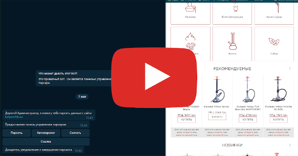

# Parser Kalyanchik

Парсер интернет-магазина  [kalyanchik.ua](https://opt.kalyanchik.ua/)

## Что из себя представляет

Парсер управляется через телеграм бота, бот предоставляет панель управления парсером. 
Парсером может управлять только администратор. Прасер работает через приватные прокси.

## Что решает

- Парсит все категории, кроме "Бонги" и "Табак" (потому что не интересует)
- Из карточек товара извлекает: 
  - Название 
  - URL 
  - Цена 
  - Наличие товара 
  - ID товара
  - Изображения 
  - Описание 
  - Название 
  - Производитель
- Из полученного товара создаёт документ .xml стандарта YML (Yandex Market Language)
- Загружает документ стандарта YML на сервер, создает ссылку, обновляет документ по расписанию

Итого: Собирает все нужные товары из kalyanchik.ua и создаёт из них прайс-лист в стандарте YML

## Что предоставляет панель управления 

- Парсить
- Парсить по расписанию
- Скачивать созданный документ YML
- Предоставлять ссылку на документ YML

## Демонстрация

*Если хотите себе такого "зверя" пишите [сюда](https://t.me/turtleua)*

